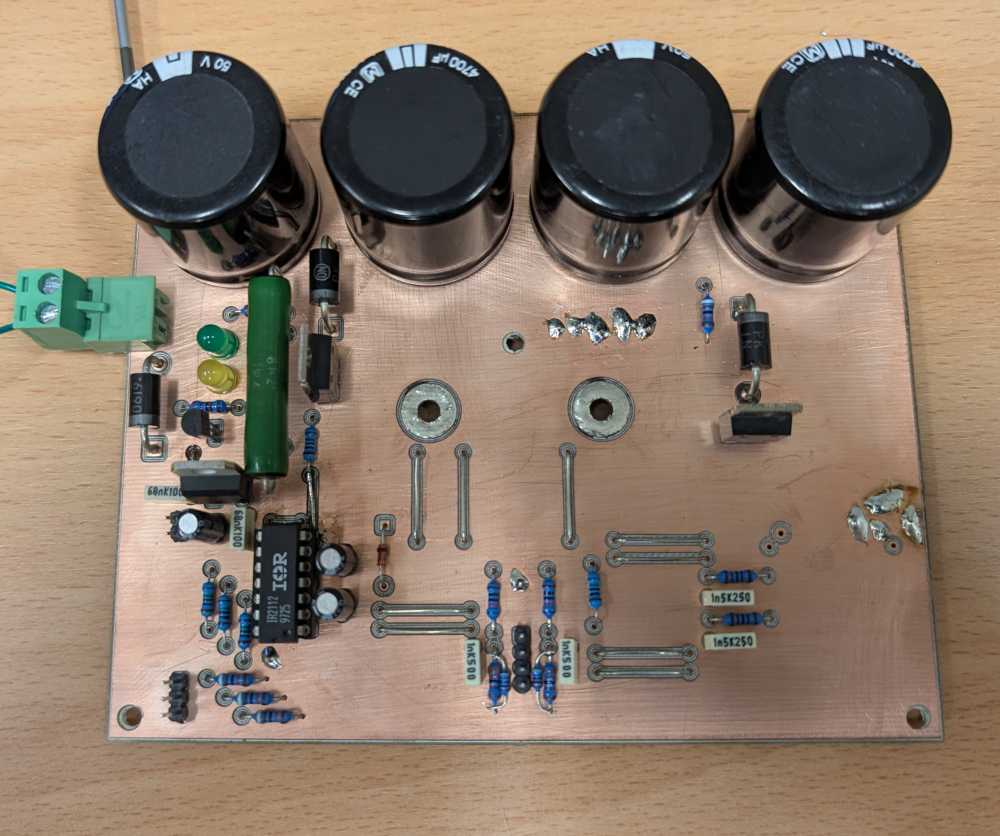
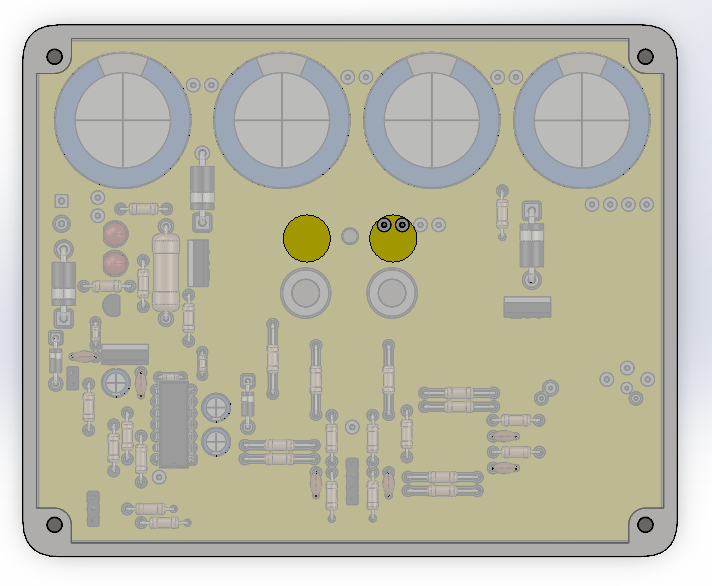
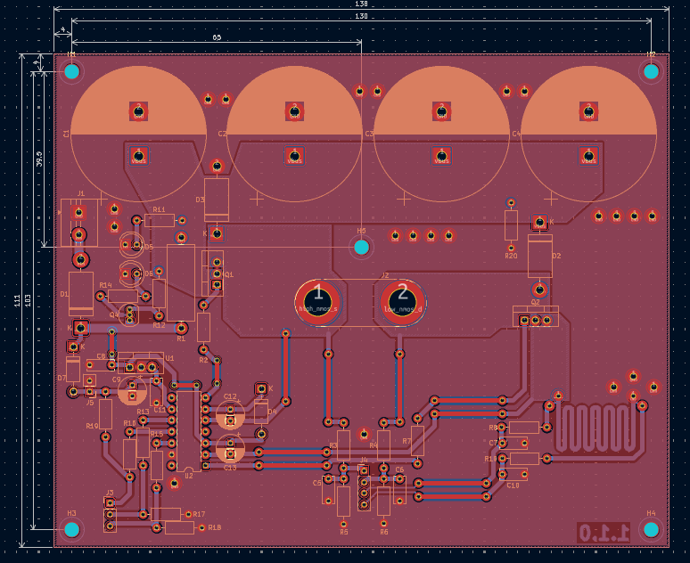

# Saturation meter

A simple saturation meter to estimate the saturation current of inductors.

This project is a quick and dirty implementation, and is not intended for production use. I need to measure the saturation current of some inductors for a project, so I built this tool to help me do that.

I used only parts I had lying around, and I want to use isolation milling, so the design is not optimal.

## Assembly

## 3D Model

To protect the circuit, I designed a simple enclosure that can be 3D printed. and laser cut.

All files are in the `cad` folder.

- [bottom.stl](cad/bottom.stl)

- [sides.stl](cad/sides.stl)

- [top.svg](cad/top.svg) (for laser cutting red 0.2mm stroke)

## Design

It is based on a discussion on the EEVblog forum: https://www.eevblog.com/forum/beginners/help-with-testing-inductor-saturation-current/
The idea is to discharge a capacitor through the inductor and measure the voltage and current across the inductor. When the inductor saturates, the dI/dt increases, (ie L decreases).

To measure the voltage and current, I use a STM32F103 with its built-in ADC. I choose to not use any op-amps to keep the design simple.

### MOSFETs

I use two N-channel MOSFETs (BUK556), they are driven by the IR2112, but not in the usual half-bridge configuration.

The low-side MOSFET (Q2) is ON before the high-side MOSFET (Q1) in order to charge the bootstrap capacitor (C12). Then Q1 is turned ON to let current flow through the inductor under test.

Almost any N-channel MOSFET with a Vds rating of at least 30V and a low Rds(on) will work. For the bootstrap capacitor (C12), I recommend at least 1uF. Because the ON time of Q1 is relatively long compared to a typical half-bridge application, a larger capacitor will help maintain the gate voltage.

### Current sensing

I don't have a proper shunt resistor, so I made a shunt using PCB traces. The shunt resistor (R9) is designed to have a resistance of **60mΩ with a 1oz** PCB. Keep in mind that the copper thermal coefficient of resistance is poor, so the resistance will vary with temperature. But because the current is measured over a short period of time, the temperature rise should be minimal.

You will need to calibrate the shunt resistor by measuring the voltage drop across it at a known current, because the actual resistance may vary due to manufacturing tolerances (especially with isolation milling).

### LEDs

Two LEDs give visual feedback about the operation of the circuit:

- D5 (green): indicates that the circuit is powered.
- D6 (yellow): inidicates that the capacitor bank is being charged.

## Schematic

## Layout

The layout is designed for isolation milling. It complies with the following rules:

- Minimum trace width: 0.2mm (recommended: 0.3mm)
- Minimum clearance: 0.3mm
- No plated through holes

I choose a **single layer design** to keep it simple, therefore traces routed on the top layer are straps. Nevertheless, I added front copper plane because the LPKG S63 I use is able to do double layer PCB. Because I cant do vias, I had to add some **jumpers to connect the top and bottom layers**.

## BOM

Use the [interactive BOM viewer](ibom.html)

| Reference | Qty | Value | Footprint |
|----------|-----|-------|-----------|
| C1,C2,C3,C4 | 4 | 4700u | Capacitor_THT:CP_Radial_D30.0mm_P10.00mm_SnapIn |
| C5,C6,C7,C10 | 4 | 1n | Capacitor_THT:C_Disc_D6.0mm_W2.5mm_P5.00mm |
| C8,C11 | 2 | 100n | Capacitor_THT:C_Disc_D6.0mm_W2.5mm_P5.00mm |
| C9,C12,C13 | 3 | 2u2 | Capacitor_THT:CP_Radial_D6.3mm_P2.50mm |
| D1,D2,D3 | 3 | 1N5822 | Diode_THT:D_DO-201AD_P15.24mm_Horizontal |
| D4,D7 | 2 | 1N4007 | Diode_THT:D_DO-41_SOD81_P10.16mm_Horizontal |
| D5,D6 | 2 | LED | LED_THT:LED_D5.0mm |
| H1,H2,H3,H4,H5 | 5 | MountingHole | MountingHole:MountingHole_3.2mm_M3_DIN965 |
| J1 | 1 | Vin | TerminalBlock:TerminalBlock_MaiXu_MX126-5.0-02P_1x02_P5.00mm |
| J2 | 1 | DUT | Connector:Banana_Jack_2Pin |
| J3 | 1 | Inputs | Connector_PinHeader_2.54mm:PinHeader_1x03_P2.54mm_Vertical |
| J4 | 1 | Outputs | Connector_PinHeader_2.54mm:PinHeader_1x04_P2.54mm_Vertical |
| J5 | 1 | UC | Connector_PinHeader_2.54mm:PinHeader_1x02_P2.54mm_Vertical |
| Q1,Q2 | 2 | BUK556 | Package_TO_SOT_THT:TO-220-3_Vertical |
| Q4 | 1 | BC638 | Package_TO_SOT_THT:TO-92_Inline |
| R1 | 1 | 10 | Resistor_THT:R_Axial_DIN0617_L17.0mm_D6.0mm_P20.32mm_Horizontal |
| R2,R7,R13,R15,R16 | 5 | 100 | Resistor_THT:R_Axial_DIN0207_L6.3mm_D2.5mm_P10.16mm_Horizontal |
| R3,R4,R12,R17,R18,R19,R20 | 7 | 8k2 | Resistor_THT:R_Axial_DIN0207_L6.3mm_D2.5mm_P10.16mm_Horizontal |
| R5,R6,R11,R14 | 4 | 1k6 | Resistor_THT:R_Axial_DIN0207_L6.3mm_D2.5mm_P10.16mm_Horizontal |
| R8,R10 | 2 | 1k | Resistor_THT:R_Axial_DIN0207_L6.3mm_D2.5mm_P10.16mm_Horizontal |
| R9 | 1 | 60m | shunt:R_Shunt_kelvin_60mohm |
| U1 | 1 | LF33_TO220 | Package_TO_SOT_THT:TO-220-3_Vertical |
| U2 | 1 | IR2112 | Package_DIP:DIP-14_W7.62mm |

## ToDo

- [ ] Add firmware code
- [ ] Add test results
